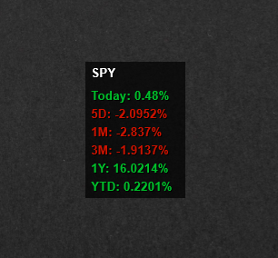

# StockChangeMonitor for Rainmeter

**StockChangeMonitor** is a Rainmeter skin that displays the current stock price change and its percentage change over various time periods:  
- 5 days
- 1 month
- 3 months
- 1 year
- Year-to-Date (YTD)

Data is fetched from [CNBC Markets](https://www.cnbc.com/markets/).

## Features
- Displays stock price changes over 5 days, 1 month, 3 months, 1 year, and YTD.
- Shows both absolute price change and percentage change for each time period.
- Easy integration with Rainmeter for quick monitoring of stock performance.

## Installation

1. Download the latest release of **StockChangeMonitor** from the [Releases page](https://github.com/yourusername/StockChangeMonitor/releases).
2. Once the download is complete, open the `.rmskin` file to install the Rainmeter skin.
3. After installation, you can enable the skin from the Rainmeter manager and place it on your desktop.

## Usage

- After installing and enabling the skin, it will automatically fetch data from CNBC Markets and display the stock changes for the selected time frames.
- You can customize the stock tickers by editing the skin settings file.

## License

This project is licensed under the **Creative Commons Attribution - Non-Commercial - Share Alike 3.0** License. See the [LICENSE](LICENSE) file for details.

## Contributing

Feel free to fork this repository, create issues for bug reports, or contribute with pull requests for improvements or new features.

## Acknowledgments

- Data sourced from [CNBC Markets](https://www.cnbc.com/markets/).
